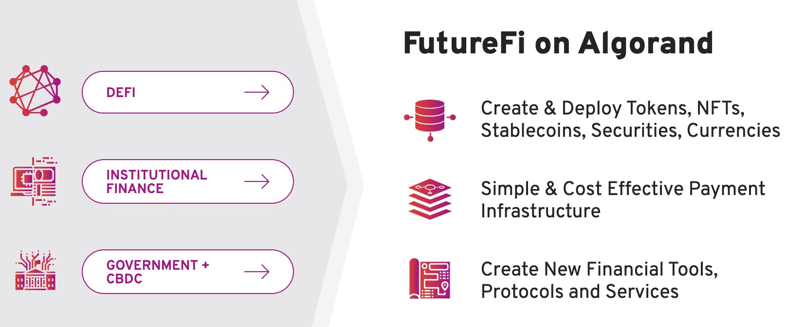

# [Theta](https://www.thetatoken.org/)

## Purpose

## Technology and products

## Group

## What they have done

## Future

# [Algorand](https://www.algorand.com/)

## Purpose

Their target is to build an ecosystem which can be used by both decentralized and traditional finance.

## Technology and products

As showed above, no matter you're DeFi users / institution users / goverment users, you can do the things on the right through Algorand.

The products contain two parts:

**1. Financial primitives (Capabilities in Layer-1)**

This part includes 4 key features:

- Smart contracts
- Algorand Standard Assests(ASA): this provides a standalized, Layer-1 mechanism to represent any type of asset on the Algorand blockchain. These can include fungible, non fungible, restricted fungible and non restricted fungible assets. **It means all kinds of digitals assets can be represented on the Algorand blockchain.**
- Atomic Transfers: provide a trustless solution in Layer-1 and offer a secure way to simutaneously transfer a number of assets among a number of parties. The transactions are grouped and all the transactions are executed or none of them are executed.
- Rekeying: allow users to change their private key without changing the public address.

**2. Core protocal**

- Pure Proof-of-Stake(PPoS): Every user who processes algos can participate in the consensus protocal. The `Verifiable Random Function(VRF)` decides which users are selected to be committee for this new block(Soft vote). This committee votes to confirm the new block. Then a new committee is selected which votes to check the block proposal of last step(Certify vote).

## Group

- Team: many of them are from MIT. And some have the cryptocoins' background, some have technology background, and some have financial background.
- Execution: the company is founded about 2.5 years and they really have done a lot of jobs. More details can be found here: [https://www.algorand.com/resources/news]()

## What they have done

A lot of applications / projects / partners are using or have relationship with Algorand. Check the full list: [https://www.algorand.com/ecosystem](https://www.algorand.com/ecosystem)

## Future
